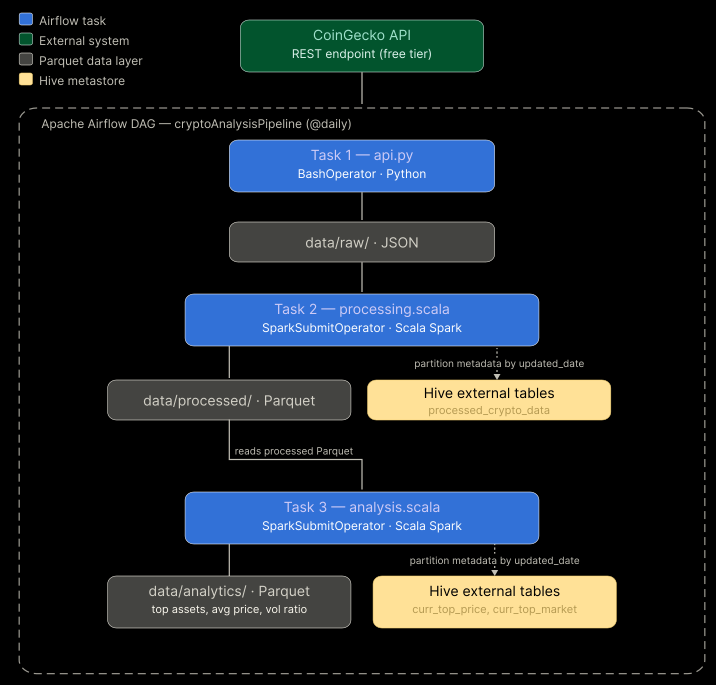

# crypto_market_analysis

An end-to-end data engineering pipeline that ingests live cryptocurrency market data from a public REST API, processes it using Apache Spark, performs analytical transformations using the Spark DataFrame API and Spark SQL, and produces a structured analytics dataset with built-in data quality validations. The pipeline is orchestrated end-to-end using Apache Airflow and implemented across Python (ingestion) and Scala (processing and analytics).

---

## Table of Contents

- [Architecture and Design](#architecture-and-design)
- [Data Quality Rules](#data-quality-rules)
- [SQL Transformations](#sql-transformations)
- [Partitioning Strategy](#partitioning-strategy)
- [Sample Output](#sample-output)
- [Assumptions](#assumptions)
- [Limitations](#limitations)
- [How to Run](#how-to-run)

---

## Architecture and Design



Cryptocurrency markets update continuously, making a scheduled daily pipeline the most appropriate design for this use case. The pipeline follows a three-layer architecture, implemented across two languages and orchestrated by Apache Airflow:

**1. Raw Ingestion — `data/raw/`**
A Python script (`src/main/python/api.py`) fetches market data from the [CoinGecko Markets API](https://docs.coingecko.com/v3.0.1/reference/coins-markets) REST endpoint and saves it as a date-stamped JSON file. This task is triggered daily by an Airflow `BashOperator`. Note that the API returns data available at the time of the request; individual coin records may have been last updated on different dates.

**2. Processed Layer — `data/processed/`**
A Scala Spark job (`src/main/scala/processing.scala`) reads the raw JSON file for the current execution date, applies data quality validations, and writes the cleaned data to Parquet format partitioned by `updated_date`. After each write, the corresponding Hive external table (`processed_crypto_data`) is updated with the new partition. This task is submitted to Spark by an Airflow `SparkSubmitOperator`.

**3. Analytics Layer — `data/analytics/`**
A second Scala Spark job (`src/main/scala/analysis.scala`) reads the full processed dataset, applies Spark SQL aggregations and window function rankings, and writes the results to `data/analytics/`. Daily snapshot tables are partitioned by `updated_date` and registered as Hive external tables; historical aggregate tables are overwritten on each run. This task is also submitted via `SparkSubmitOperator`.

**Orchestration**
All three stages are defined as sequential tasks in an Airflow DAG (`dags/crypto_pipeline_dag.py`), scheduled to run daily. The DAG passes the execution date (`{{ ds }}`) to each task, ensuring each stage processes only the data relevant to that day's run.

**Build**
The Scala source files are compiled into a single JAR using `sbt` before the pipeline is run. Airflow submits this JAR to Spark for both the processing and analytics stages.

```
task_1 (api.py) >> task_2 (Processing.jar) >> task_3 (Analytics.jar)
```

---

## Data Quality Rules

The following validation rules are applied during the processing stage. Records that fail these checks are excluded from the processed dataset.

- **Duplicate removal** — Records are deduplicated based on all columns excluding timestamp fields.
- **Non-negative values** — Rows where `current_price`, `market_cap`, `total_volume`, `circulating_supply`, or `total_supply` are negative are filtered out.
- **Null value handling** — Rows with null values in critical numeric fields (`current_price`, `market_cap`, `total_volume`, `circulating_supply`, `total_supply`) are dropped.
- **Type casting** — Timestamp fields (`last_updated`, `ath_date`, `atl_date`) are cast to proper timestamp types to ensure schema consistency.
- **Derived date column** — An `updated_date` column is extracted from `last_updated` for partitioning and date-based analysis.

> **Note:** The CoinGecko free tier does not guarantee uniform coin coverage across API calls. Some coins may appear on fewer days than others, which affects the reliability of cross-coin averages over time.

---

## SQL Transformations

Spark SQL is used for all aggregation and ranking queries. DataFrames are registered as temporary views before querying.

**Average Market Capitalisation by Coin**

Calculates the average market cap per coin across all ingested dates, then ranks coins in descending order.

```sql
WITH avg_market AS (
    SELECT name, AVG(market_cap) AS avg_market_cap
    FROM crypto_prices
    GROUP BY name
)
SELECT *, RANK() OVER (ORDER BY avg_market_cap DESC) AS avg_market_cap_rank
FROM avg_market
```

**Average Price by Coin**

Calculates the average current price per coin across all ingested dates, then ranks coins in descending order.

```sql
WITH average_prices AS (
    SELECT name, AVG(current_price) AS average_price
    FROM crypto_prices
    GROUP BY name
)
SELECT *, RANK() OVER (ORDER BY average_price DESC) AS avg_price_rank
FROM average_prices
```

Both queries use **window functions** (`RANK() OVER`) to assign rankings without collapsing the result set, which allows the rankings to be joined back to other metrics in the final analytics output.

---

## Partitioning Strategy

The processed Parquet data is partitioned by `updated_date`.

This decision is motivated by two factors:

1. **Pipeline design** — Because the scheduler appends new data daily, partitioning by date ensures each run writes to its own partition, preventing data fragmentation and avoiding overwrites of historical records.
2. **Query efficiency** — Several analytical operations target only the most recent snapshot, while others compute averages across all dates. Date-based partitioning enables Spark to apply partition pruning, allowing these queries to read only the relevant subset of data rather than scanning the full dataset.

---

## Sample Output

The table below shows a sample of the final analytics output, combining average market cap, average price, total volume, and volume-to-market-cap ratio rankings into a single top-performing assets view.

| name        | top_performing_rank |   avg_market_cap   | avg_market_cap_rank | average_price | avg_price_rank |   total_volume  | vol_market_ratio | vol_market_rank | top_performing_score |
|-------------|:-------------------:|:------------------:|:-------------------:|:-------------:|:--------------:|:---------------:|:----------------:|:---------------:|:--------------------:|
| Ethereum    |          1          |  2.447566175596E11 |          2          |    2026.751   |        4       | 3.1391592618E10 |      0.12236     |        27       |           8          |
| Bitcoin     |          2          | 1.3776601759463E12 |          1          |    68839.2    |        1       |  7.194525264E10 |      0.12236     |        52       |          11          |
| Solana      |          3          |  4.92225953663E10  |          7          |     86.283    |       13       |  6.426767762E9  |      0.12365     |        26       |          13          |
| Tether Gold |          4          |   2.8750949604E9   |          35         |    5173.367   |        3       |   9.75957539E8  |      0.12365     |        8        |          17          |
| PAX Gold    |          5          |   2.5447346606E9   |          37         |    5214.701   |        2       |   7.61452059E8  |      0.12365     |        11       |          18          |
---

## Assumptions

**Top-Performing Coin Ranking Methodology**

Coins are ranked using a weighted sum across three market metrics, each selected for its relevance to long-term coin performance:

- **Market Capitalisation** — A higher market cap indicates a more established coin with greater market presence.
- **Price** — Price is used as a proxy for demand. In cryptocurrency markets, price and demand tend to correlate more directly than in traditional asset classes.
- **Volume/Market Cap Ratio** — Used as a measure of market stability. A disproportionately high ratio indicates elevated buy/sell activity relative to the coin's size, which may signal volatility.

The composite rank is calculated as a weighted sum with the following weights:

| Metric                  | Weight |
|-------------------------|--------|
| Market Capitalisation   | 0.4    |
| Price                   | 0.4    |
| Volume/Market Cap Ratio | 0.2    |

Rankings are derived from historical data rather than single-day snapshots, as aggregated metrics are less susceptible to short-term market fluctuations.

---

## Limitations

- The CoinGecko free tier API returns up to 250 coins per request and does not provide bulk historical data. Historical depth is accumulated organically through daily scheduled runs.
- Not all coins are returned consistently across every API call. Average-based metrics should be interpreted with this in mind, as some coins may have fewer data points than others.
- The `updated_date` column is derived from the `last_updated` field provided by the API, which reflects when CoinGecko last updated that coin's data — not necessarily when the pipeline ran.

---

## How to Run

The pipeline is designed to be orchestrated via Apache Airflow. The following outlines the setup required to reproduce the environment locally.

### Prerequisites

- **Java 17 or above** — Required by Apache Spark.
- **Python 3.8 or above** — Required for Airflow and the ingestion script.
- **Scala 2.13 and sbt** — Required to compile the processing and analytics Spark jobs into a JAR.
- **Apache Airflow** — Used to orchestrate the pipeline. The project was developed and tested using Airflow in standalone mode.
- **A CoinGecko API key** — A free key can be obtained from the [CoinGecko API portal](https://docs.coingecko.com/v3.0.1/reference/coins-markets).

### 1. Clone the Repository

```bash
git clone https://github.com/snehamungre/crypto_market_analysis.git
cd crypto_market_analysis
```

### 2. Install Python Dependencies

```bash
pip install -r requirements.txt
```

### 3. Configure the API Token

Create a `.env` file in the project root directory with the following contents:

```
API_KEY=your_coingecko_api_key_here
```

Do not commit this file to version control — it is excluded via `.gitignore`.

### 4. Compile the Scala JAR

From the project root, run:

```bash
sbt package
```

This compiles `processing.scala` and `analysis.scala` into a single JAR at `target/scala-2.13/cryptomarketanalysis_2.13-1.1.jar`, which Airflow submits to Spark.

### 5. Configure Airflow
Start Airflow in standalone mode by running the following command in the terminal:
bashairflow standalone

This will start the Airflow UI at http://localhost:8080. Login credentials are generated automatically and can be found in the `simple_auth_manager_passwords.json.generated` file in the Airflow home directory.

In the Airflow UI, set the following before triggering the DAG:

- **Variable** — `crypto_project_base_path`: the absolute path to the project root on your machine.
- **Connection** — `spark_default`: a Spark connection pointing to your local Spark installation.

### 6. Trigger the DAG

Start Airflow in standalone mode and enable the `cryptoAnalysisPipeline` DAG. The pipeline will run daily, or can be triggered manually for a specific execution date.

### 7. View the Output

Analytical results are written to `data/analytics/` after each successful run. Hive external tables are registered and updated automatically during each pipeline execution.


